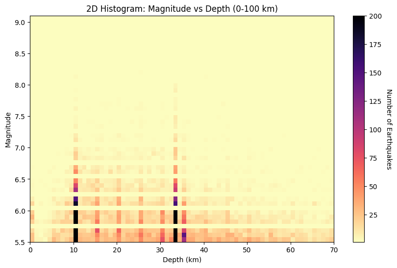
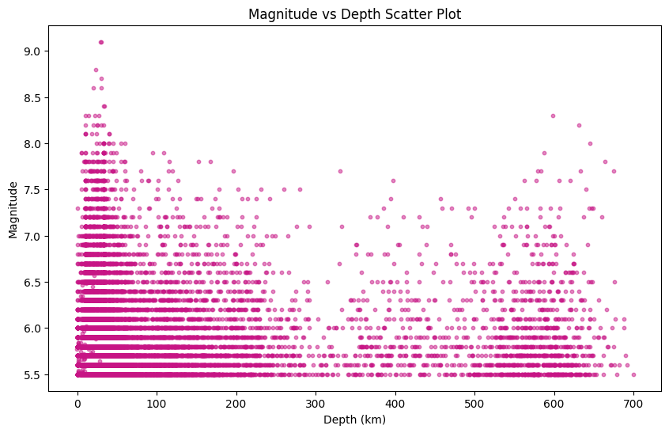
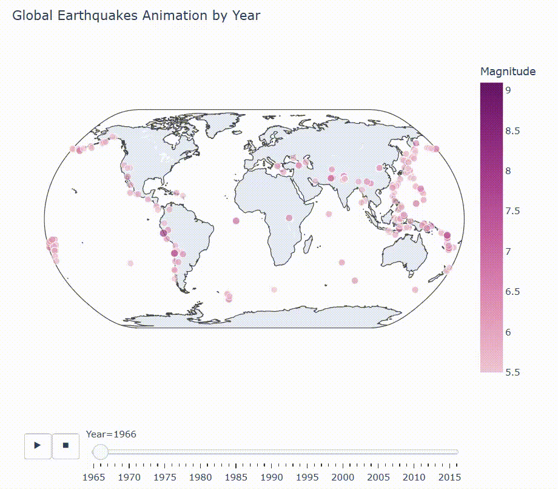

# Earthquake Analyzer with NumPy

## Description
This project analyzes global earthquake data using NumPy, with optional visualizations using Matplotlib and Plotly.  
It performs data cleaning, time-based aggregation, magnitude and depth analysis, and generates interactive animations of earthquake occurrences worldwide.  

---

### Example Outputs

#### Magnitude vs Depth (Histogram)


#### Magnitude vs Depth (Scatter Plot)


#### Global Earthquake – Map Visualization


#### Interactive Global Earthquake Map

🖱️: ̗̀➛ <a href="https://busracevik.github.io/numpy-earthquake-analyzer/docs/earthquake_animation.html" target="_blank"> Interactive Earthquake Map (LIVE)</a>

---

## Dataset
This project uses the **Significant Earthquakes 1965-2016 Dataset** available from [Kaggle](https://www.kaggle.com/datasets/usgs/earthquake-database).  
It contains historical earthquake records with columns including **Date, Latitude, Longitude, Magnitude, Depth**, etc.The dataset allows analysis of 
temporal trends, magnitude distribution, depth-magnitude relationships, and global earthquake animation.  

---

## Features
- Data cleaning and preprocessing with NumPy  
- Handling missing values and filtering extreme outliers  
- Time series analysis: earthquakes per year, yearly average magnitude  
- Magnitude vs Depth analysis with histogram and scatter plots  
- Global earthquake animation by year using Plotly  
- Persistent outputs saved to `data/output/` (PNGs, HTML)  

---

## Technologies
- Python 3.x  
- NumPy  
- Pandas  
- Matplotlib (for static visualizations)  
- Plotly (for interactive animations)  

---

## Project Structure

```text
earthquake-analyzer/
│
├── data/
│   ├── dataset/           # Original CSV data
│   │   └── database.csv
│   └── output/            # Generated outputs
│       ├── hist_depth_mag.png
│       └── scatter_depth_mag.png
│
├── src/                   # Modular code
│   ├── data_loader.py     # Load & clean CSV data
│   ├── time_analysis.py   # Extract year & yearly statistics
│   ├── depth_mag.py       # Depth vs Magnitude plots
│   └── plotly_map.py      # Interactive map preparation & plotting
│
├── docs/                      
│   ├── earthquake_animation.html
│   └── interactive_country_map_demo.gif
│
├── main_unmodularized.py  # Original monolithic code
├── main.py                # Modularized version calling functions from src/
└── README.md
```
---

## Development History

### Initial Version (`main_unmodularized.py`)
- All code in a single file
- Basic filtering, plotting, and statistics
- Terminal outputs and manual visualizations

### Modular Version (`main.py`)
- Code refactored into reusable functions in `src/`
- Automatic PNG and HTML output generation
- Easier maintenance and scalability

---

## Use Case
This project demonstrates how large-scale earthquake datasets  
can be processed efficiently using NumPy and Pandas.  
It also shows a workflow from **raw CSV analysis** to **modular, reusable code**  
with persistent outputs (plots and interactive maps) for reporting or further research.
